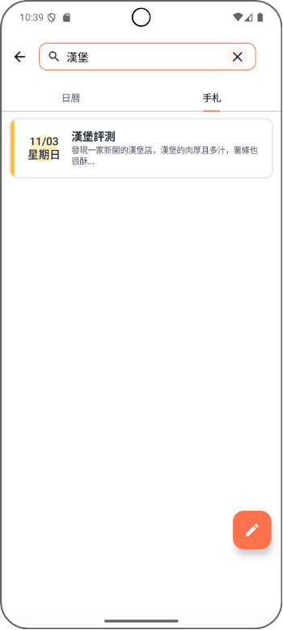

# 美食獵人 Food Hunter App

美食獵人是一款結合餐廳搜尋、社群分享與揪團功能的 Android 應用程式，致力於解決使用者的用餐選擇困擾。

    
    

## 目錄

- [功能特色](#六大核心功能)
- [系統架構](#系統架構)
- [技術實現](#技術實現)
- [安裝說明](#安裝說明)
- [相關連結](#相關連結)
- [意見回饋](#意見回饋)

## 六大核心功能

### 1. 會員中心

- 會員註冊與登入
- 個人資料管理

### 2. 社群發文

- 美食貼文分享
- 社群留言互動

### 3. 搜尋餐廳

- 整合 Google Places API
- 地理位置搜尋
- 多樣化篩選條件

### 4. 餐廳評論

- 星星數評分
- 評論按讚

### 5. 揪團群聊

- Firebase 即時群體聊天功能
- 揪團管理

### 6. 日曆筆記

- 個人美食日記
- 行事曆

日曆功能 ⬇️

    
    
    

筆記功能 ⬇️

    
    
    

## 系統架構

    

### 前端架構 (Android)

> 採用現代化 Android開發技術棧，注重程式碼可維護性與使用者體驗

- MVVM 架構：UI和業務邏輯分離的架構，增加可維護性
- Jetpack Compose：Kotlin聲明式 UI框架，簡化 UI開發與方便管理 UI狀態
- Material Design 3:透過設計規範，實現一致性的 UI視覺體驗

### 後端架構

> 採用傳統 Java Web技術搭配 Google Cloud服務

- Java Servlet：基於 Tomcat，負責處理前後端通訊，提供 API接口
- JDBC：負責與 MySQL DB交互
- Google Cloud MySQL DB：雲端資料庫，負責數據存取
- Google Cloud Firebase（FCM）：負責即時訊息推播

## 技術實現

    

### 開發工具

- Android Studio
- Eclipse IDE
- MySQL Workbench
- Postman API 測試工具
- Source Tree + GitHub（Git版本控管）

## 安裝說明

### 系統需求

- Android 6.0 以上版本
- 需要網路連線
- 需要位置權限

## 相關連結

- [後端程式碼庫](https://github.com/MaiSharon/com.tibame.foodhunter_server)

## 意見回饋

如果您有任何問題或建議，歡迎透過以下方式聯繫：

- Email：ppp300a@gmail.com
- GitHub Issues
